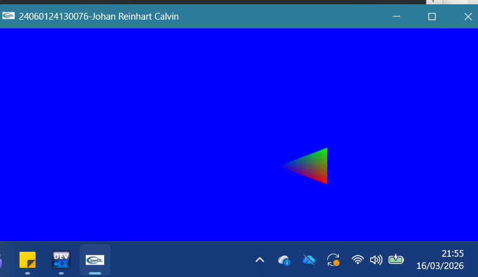
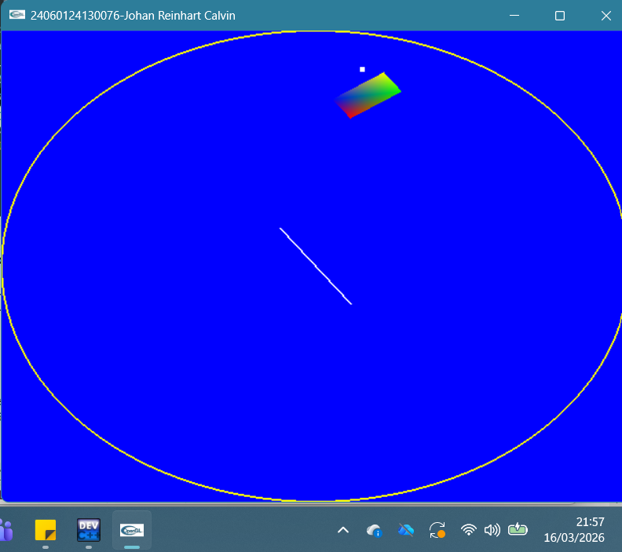
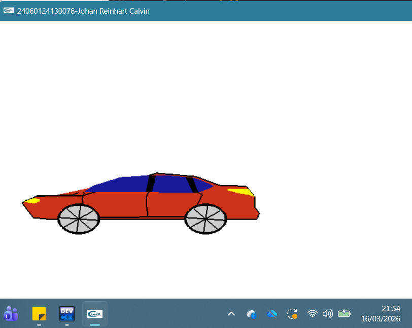

Nama  :Johan Reinhart Calvin  
NIM  ;24060124130076  
Translasi: Persegi merah yang dapat bergerak dengan metode translasi  dengan W,A,S,D
  

Rotasi: Segitiga warna warni yang dapat berotasi dengan A atau D  
  

Stack: Kumpulan bangun datar yang dapat berotasi dengan A atau D  
  

Mobil: Mobil merah yang bergerak dari kanan ke kiri dengan ban berotasi  
  
