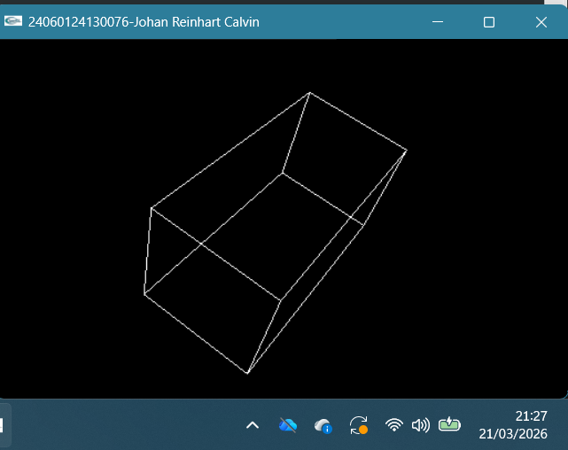
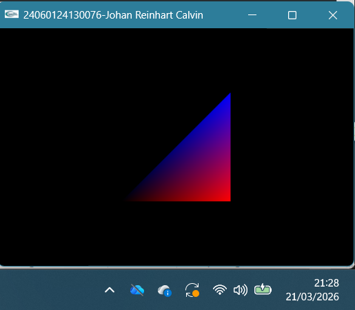
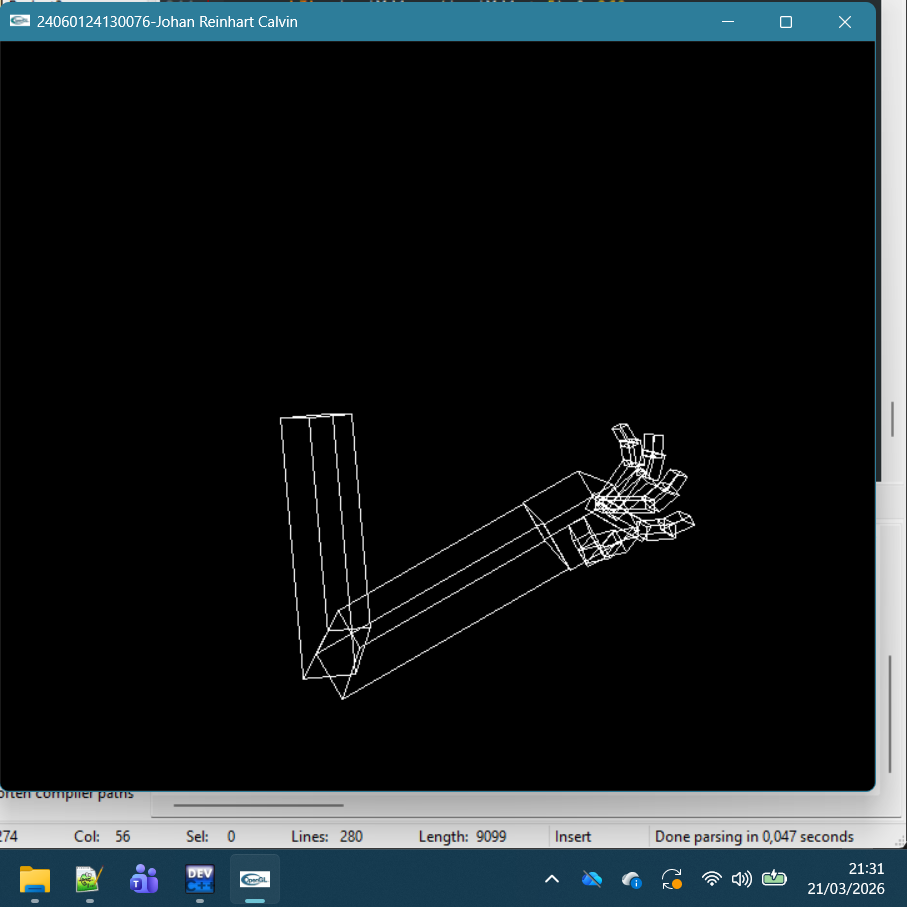
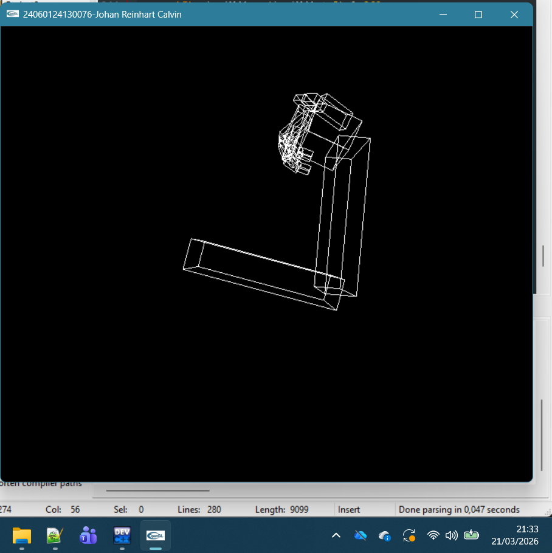
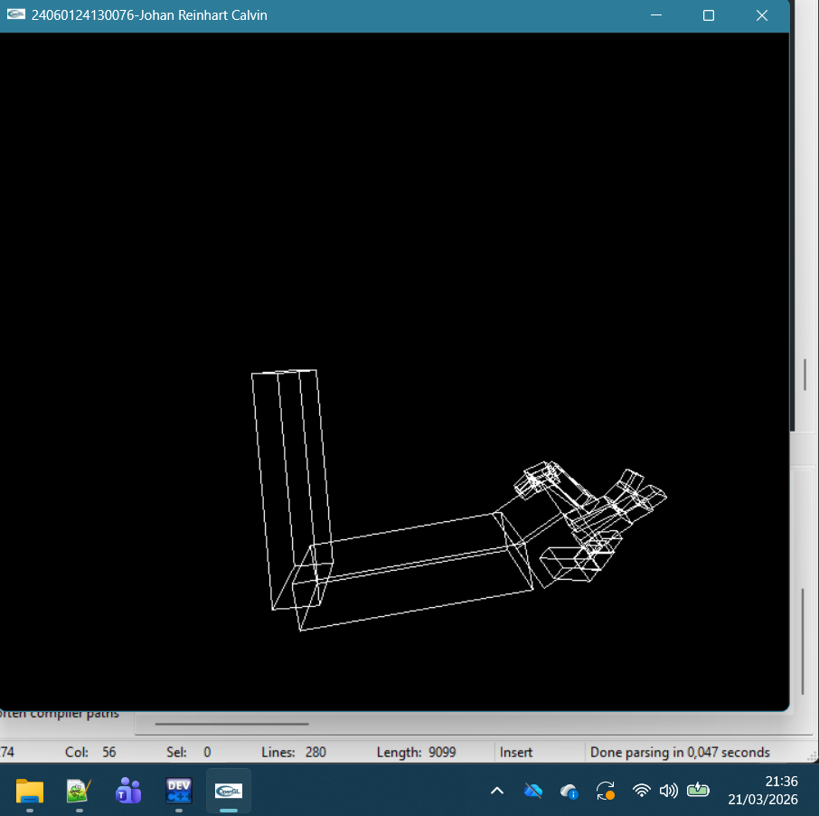

Nama  :Johan Reinhart Calvin  
NIM    :24060124130076  

Kubus:Menunjukkan sebuah rusuk kubs yang berotasi menunjukkan dimensi 3  
  

Proyeksi:Menunjukkan proyeksi segitiga jika dilihat dari perspektif 2 dimensi  
  

Lengan:Menunjukkan proyeksi dari Lengan lengkap dari bahu, lengan,tangan beserta 5 jari  
  
  
  
